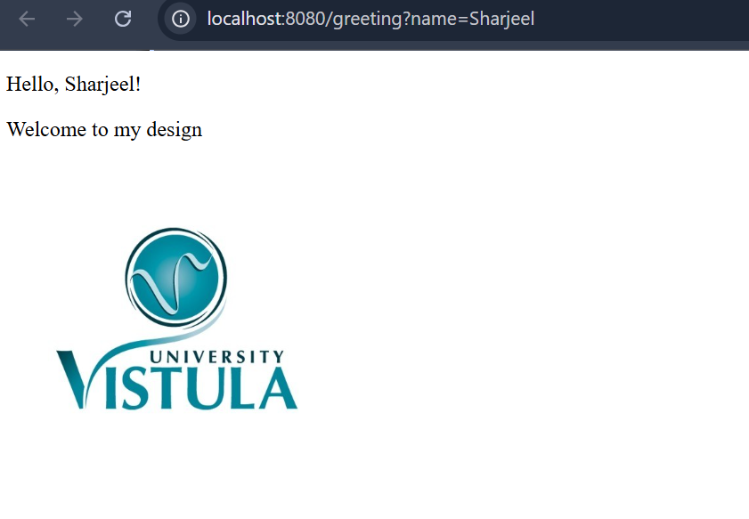

# First Task - Spring Boot Application

## Description
This project is a simple Spring Boot web application using Thymeleaf.

## What was used
- Java
- Spring Boot
- Thymeleaf
- Maven

## How to use

local host/greeting?name=YOURNAME

Example:
http://localhost:8080/greeting?name=Sharjeel
